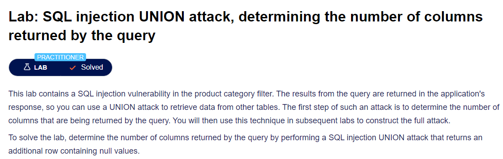

# SQL Injection Column Detection Script



This script demonstrates SQL injection techniques to detect the number of columns in a vulnerable web application in PortSwigger. It uses Python's `requests` library to handle HTTP requests.

## Features

- Uses `ORDER BY` SQL injection to determine the number of columns.
- Uses `UNION SELECT` SQL injection to verify the number of columns.
- Displays the payload and results of the injection attempts.

## Prerequisites

- Python 3.x
- `requests` library

You can install the required library using:
```bash
pip install requests
```

## Usage
1. Clone the repository or download the script.
2. Modify url variable on script with yours.

2. Run the script with Python.
3. The script will automatically test different categories and display the results.

## Example Run
1. Run the script:
python determine_columns.py
2. The script will test each category, display the number of columns determined by the ORDER BY injection, and verify it using UNION SELECT.

## Disclaimer
This script is for educational purposes only. Unauthorized use of this script on any web application without permission is illegal and unethical. Always ensure you have explicit permission before testing any web application for vulnerabilities.

## License
This project is licensed under the MIT License - see the LICENSE file for details.
